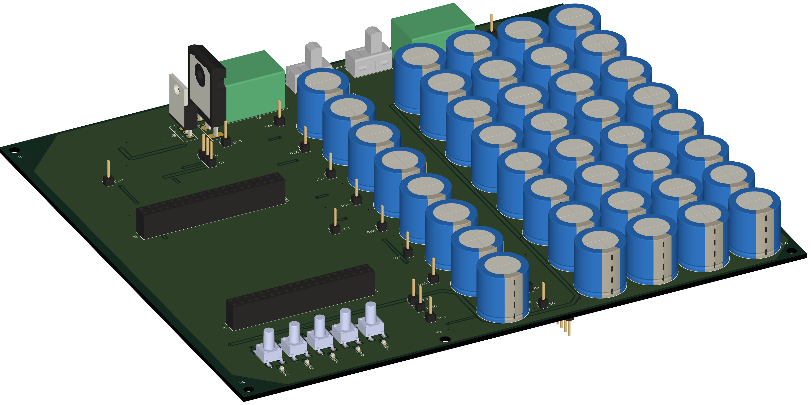
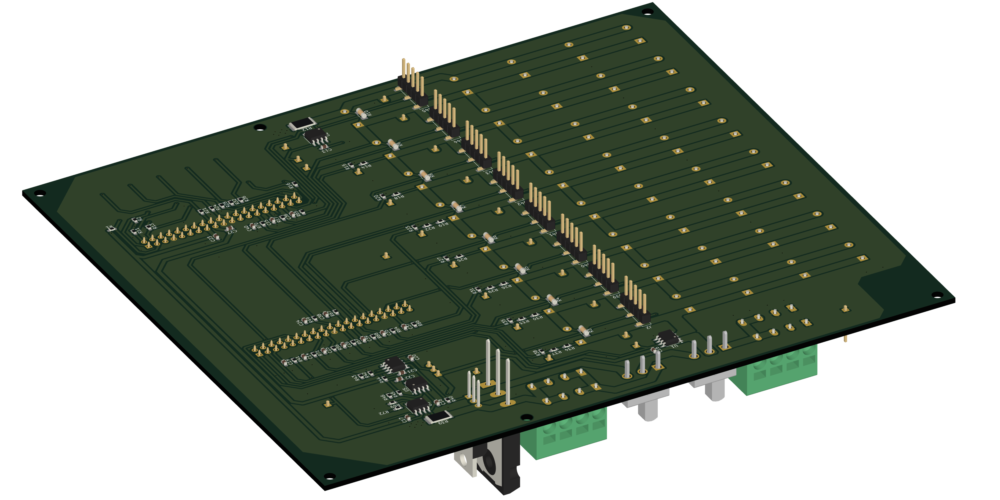
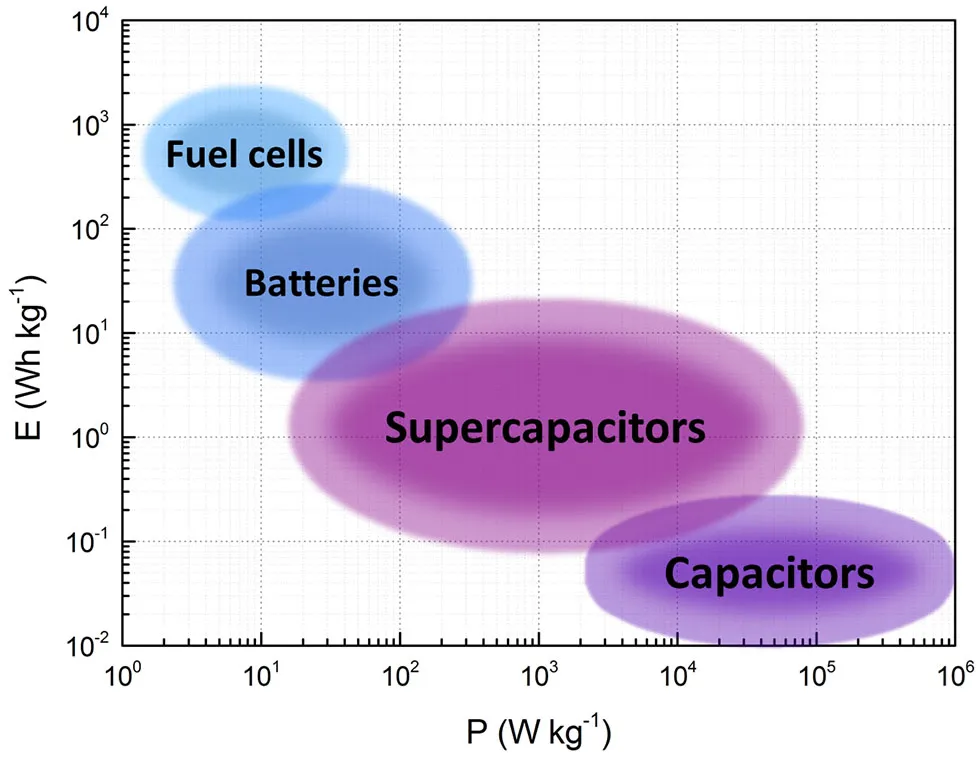
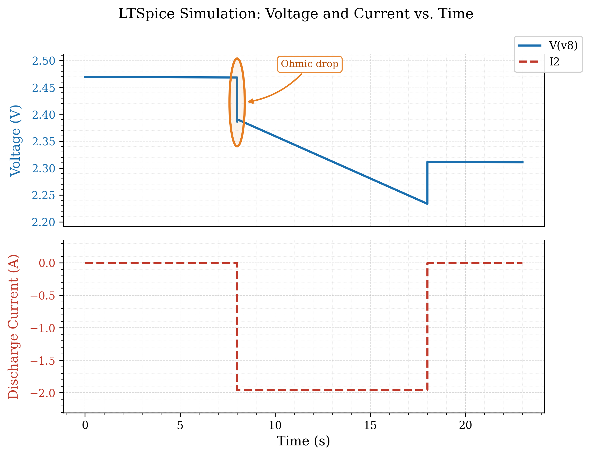

# Microcontroller-Based Health Monitoring System for Supercapacitors


**Master's Thesis — Hochschule Bremen, Department of Electronics Engineering**
In cooperation with BLOCK Transformatoren-Elektronik GmbH

| | |
|---|---|
| **Author** | Golakiya Dixit |
| **Date** | 06.05.2026 |
| **Examiners** | Prof. Dr.-Ing. Dennis Kampen, Prof. Dr.-Ing. Friedrich Fleischmann |
| **Supervisor** | Dipl.-Ing. Henning Sauerland |

📄 Full thesis report: [`docs/Master_Thesis_5274929_Dixit_Golakiya.pdf`](docs/Master_Thesis_5274929_Dixit_Golakiya.pdf)

---

## Table of Contents

- [Abstract](#abstract)
- [Gallery](#gallery)
- [System Overview](#system-overview)
- [Repository Structure](#repository-structure)
- [Hardware Summary](#hardware-summary)
- [Firmware Summary](#firmware-summary)
- [Build / Open Instructions](#build--open-instructions)
- [Results Snapshot](#results-snapshot)
- [License](#license)
- [Citation](#citation)

---

## Abstract

Supercapacitors are increasingly used in energy storage applications due to their
high power density, rapid charge–discharge capability, and long cycle life. Their
performance degrades over time through capacitance fade and rising equivalent
series resistance (ESR), so monitoring state of health (SoH) is essential for
system efficiency, reliability, and safety.

This project implements a microcontroller-based health monitoring system on an
STM32G474RE platform. The system measures voltage and current during
galvanostatic charge/discharge cycles to estimate per-cell capacitance and ESR
in real time — with no external lab instrumentation. ESR is extracted from the
instantaneous ohmic voltage drop at discharge start, and capacitance from a
least-squares linear regression over the discharge slope. Both run entirely on
the MCU after each discharge cycle, with results reported over UART.

The system was validated on a 40-cell (5 parallel × 8 series) Vishay 25 F
supercapacitor bank, including artificially aged cells (accelerated thermal
ageing), across eleven test configurations. Aged cells were correctly localised
in every tested configuration, with capacitance drops of 10.9–16.5% in
single-string tests and a practical detection floor of ~10% per-cell loss in a
four-string parallel bank.

---

## Gallery

<table>
<tr>
<td width="50%">

<p align="center"><sub><b>Assembled board — isometric view</b></sub></p>
</td>
<td width="50%">

<p align="center"><sub><b>Assembled board — alternate angle</b></sub></p>
</td>
</tr>
<tr>
<td width="50%">

<p align="center"><sub><b>PCB 3D render — top</b></sub></p>
</td>
<td width="50%">

<p align="center"><sub><b>PCB 3D render — bottom</b></sub></p>
</td>
</tr>
<tr>
<td width="50%">

<p align="center"><sub><b>Galvanostatic discharge waveform</b></sub></p>
</td>
<td width="50%">

<p align="center"><sub><b>Least-squares capacitance regression</b></sub></p>
</td>
</tr>
<tr>
<td width="50%">

<p align="center"><sub><b>Power density comparison</b></sub></p>
</td>
<td width="50%">

<p align="center"><sub><b>LTspice discharge model simulation</b></sub></p>
</td>
</tr>
</table>

Higher-resolution schematic renders (front/back copper) are also available as PDFs in
[`Figure/`](Figure/): [`A_Super_Capacitor_measurement.pdf`](Figure/A_Super_Capacitor_measurement.pdf),
[`B_1_Super_Capacitor_measurement-F_Cu.pdf`](Figure/B_1_Super_Capacitor_measurement-F_Cu.pdf),
[`B_2_Super_Capacitor_measurement-B_Cu.pdf`](Figure/B_2_Super_Capacitor_measurement-B_Cu.pdf).

---

## System Overview

```
STM32G4 Nucleo-64 Board
   ├── Voltage Divider Network                  → 8 series-cell node voltages → ADC
   ├── Shunt Current Sensors (INA241A1 × 2)      → analog input
   ├── Hall-Effect Sensor (TMCS1108A3)           → analog input, isolated
   ├── MOSFET Current Sink (IRL540N / FQA140N10) → DAC/PWM controlled
   ├── Threshold Comparators (TLV3541)           → hardware end-of-discharge trigger
   ├── User Buttons (S1–S7) + Status LEDs
   └── UART Interface → external monitor / logging
```

**Key design points:**

- 12-bit ADC with 32× hardware oversampling → ~14.5-bit ENOB, enabling ohmic-drop
  resolution without external instrumentation amplifiers.
- Per-cell (per-node) resolution — a bank-level average alone cannot localise
  which cell is degrading.
- ESR from a 10-sample pre-trigger baseline vs. first post-commutation sample.
- Capacitance from a sliding-window least-squares regression (tiered by R²/RMSE
  quality) over the constant-current discharge slope, from `Vrated` down to
  `0.866 × Vrated` (75% of stored energy).
- Cross-validated current sensing across two INA241A1 shunt amplifiers and one
  isolated Hall-effect sensor.

---

## Repository Structure

```
.
├── README.md
├── LICENSE
├── .gitignore
│
├── docs/
│   └── Master_Thesis_5274929_Dixit_Golakiya.pdf   # Full thesis (Golakiya Dixit, HSB, 2026)
│
├── Figure/                          # Photos, renders, and plots used in this README / thesis
│
├── Hardware/
│   └── KiCad/                       # KiCad 9.0 project — schematics + 2-layer PCB
│       └── README.md
│
├── Simulation/
│   └── LTSpice/                     # LTspice models: divider network, DAC current sink,
│       └── README.md                # first-order ESR/capacitance discharge model
│
├── Firmware/
│   └── STM32/                       # STM32CubeIDE / HAL firmware (FSM-based)
│       └── README.md
│
└── results/                         # Measurement data, plots, validation exports
```

## Hardware Summary

| Component                | Part                                  | Role                                     |
| ------------------------ | -------------------------------------- | ----------------------------------------- |
| MCU                       | STM32G474RE (Nucleo-64)               | ADC/DAC, regression math, FSM control    |
| Supercapacitors           | Vishay 25 F × 40 (5P-8S)              | Bank under test — 24 V, 15.625 F nominal |
| Current sense (shunt)     | INA241A1 × 2                          | High-accuracy discharge/charge current   |
| Current sense (isolated)  | TMCS1108A3                            | Redundant, galvanically isolated         |
| Current sink MOSFET       | IRL540N (TO-220) / FQA140N10 (TO-247) | Galvanostatic discharge load             |
| Comparators                | TLV3541 × 2                          | Hardware end-of-discharge interrupt      |
| PCB                        | KiCad 9.0, 2-layer, 192 mm × 166 mm  | Custom board around Nucleo-64            |

## Firmware Summary

Six-state FSM: **Initialisation → Idle → Pre-trigger Acquisition → Discharge →
Parameter Extraction → Result Transmission**, driven by hardware comparator
interrupts and DMA-buffered ADC acquisition (14 channels across ADC1/ADC2/ADC5,
synchronised via TIM3 at 1 kHz). Written in C using STM32CubeIDE + HAL.

## Build / Open Instructions

- **Hardware:** Open `Hardware/KiCad/*.kicad_pro` in **KiCad 9.0** or later.
- **Simulation:** Open `.asc` files in `Simulation/LTSpice/` with **LTspice
  XVII (v24.1.5)** or later.
- **Firmware:** Import `Firmware/STM32/` as an existing project in
  **STM32CubeIDE**, or regenerate the base code from the included `.ioc` file
  via STM32CubeMX. Flash to a **NUCLEO-G474RE** board.

See the README in each subfolder for details specific to that part.

## Results Snapshot

- Parallel capacitance scaling within **1.1%** of theoretical `Np × Csingle`.
- Regression fit quality: **R² > 0.993** across all tested configurations.
- Aged-cell detection: **0 false positives** across all 11 test configurations.
- Repeatability: capacitance measurements stable to **±0.13 F (1.0%)** across
  9 repeated sessions on the same bank.

Full data, per-configuration plots, and discussion are in Chapter 4 of the
thesis report.

## License

See [`LICENSE`](LICENSE). Choose a license appropriate for your work (e.g. MIT
for firmware/tooling, CERN-OHL for hardware) — update this section once
decided.

## Citation

If referencing this work:

```
Golakiya Dixit, "Development of a Microcontroller-Based Health Monitoring
System for Supercapacitors in Energy Storage Applications," Master's Thesis,
Hochschule Bremen, 2026.
```
